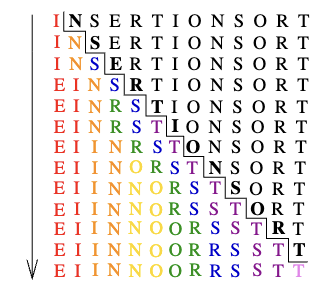

# Algoritma Tasarımına Giriş

Algoritma nedir? Belirli bir görevi sonuçlandırmak için bir prosedür. Algoritma her mantıklı bilgisayar programının arkasında bulunan fikirdir.

Bir anlamı olması için, bir algoritmanın genel, iyi tanımlı bir *problemi* çözmesi beklenir. Bir algoritmik problem; üzerinde çalışması gereken tüm *örnekler* (instances) kümesi ve bu örneklerden biri üzerinde çalıştırıldıktan sonra elde edilecek çıktı tanımlanarak belirlenir. Bir problemin kendisi ve örneği arasındaki bu ayrım önemlidir. Örneğin, *sıralama* olarak bilinen algoritmik *problem* şu şekildedir:

*Problem:* Sıralama

*Input:* $a_1, \ldots, a_n$ şeklinde $n$ elemanlı bir dizi.

*Output:* $a'_1 \leq a'_2 \leq \cdots \leq a'_{n-1} \leq a'_n$ olacak şekilde girilen dizinin permütasyonu (yeniden sıralaması).

Sıralamanın bir *örneği* ${154, 245, 568, 324, 654, 324}$ gibi bir sayı dizisi yahut ${Mike, Bob, Sally, Jill, Jan}$ gibi bir isim listesi olabilir. Problemin bir örneğinden ziyade genel hali ile uğraştığınızı anlamak onu çözmenizin ilk adımıdır.

Bir *algoritma* mümkün olan girdi örneklerinden herhangi birini alarak onu arzu edilen çıktıya dönüştüren bir prosedürdür. Sıralama problemini çözebilen çok sayıda farklı algoritma mevcuttur. Mesela, eklemeli sıralama (*insertion sort*) tek bir elemanla başlayıp (böylece aslında sıralanmış bir liste oluşturup) kalan elemanları liste sıralı kalacak şekilde bu listeye eklemek şeklinde bir yöntemdir. Bu yöntemle "INSERTIONSORT" kelimesindeki harflerin sıralanmasının mantıksal akışı Şekil 1.1'de gösterilmektedir.



Şekil 1.1: Eklemeli sıralama eyleminin animasyonu (zaman aşağı yönde ilerler).

Bu algoritmanın C dilinde implementasyonu şöyledir:

``` C
void insertion_sort(item_type s[], int n) {
    int i, j;    /* counters */

    for (i = 1; i < n; i++) {
        j = i;
        while ((j > 0) && (s[j] < s[j - 1])) {
            swap(&s[j], &s[j - 1]);
            j = j - 1;
        }
    }
}
```

Bu algoritmanın genelliğine dikkat ediniz. İsimlerde çalıştığı gibi sayılarda da çalışır. Veya başka herhangi bir şeyde, yeter ki karşılaştırma operatörü (<) iki anahtardan hangisinin sıralamada önce geleceğini belirleyebilsin. Bu algoritmanın sıralama problemi tanımımıza uygun her girdi örneğini doğru bir şekilde sıraladığı teyit edilebilir.

İyi bir algoritma için arzu edilen üç nitelik vardır. *Doğru* ve *etkin* olan, aynı zamanda *uygulaması kolay* algoritmaları ararız. Bu amaçlara hemen ulaşamayabiliriz. İş dünyasında, daha iyi bir algoritmanın varlığından bağımsız olarak, uygulamayı yavaşlatmadan yeterince iyi cevapları veren programlar genelde kabul görür. Mümkün olan en iyi cevabı bulmak veya maksimum etkinliğe erişmek genelde ciddi performans veya hukuki sorunların ardından gündeme gelir.

Bu bölümde algoritma doğruluğuna odaklanarak algoritma etkinliği ile ilgili konuları ikinci bölüme bırakacağız. Verilen bir algoritmanın belli bir problemi doğru çözdüğünün bariz şekilde ortada olmasına nadir rastlanır. Doğru algoritmalar genellikle bir kanıtla birlikte gelir, bu kanıt algoritmanın problemin her örneğini doğru sonuçlandırdığını nereden bildiğimizi açıklar. Daha derine inmeden, *açıkça bellinin* neden asla doğruluk kanıtı olarak yeterli olmadığını ve genellikle de yanlış olduğunu göstermemiz gerekiyor.

