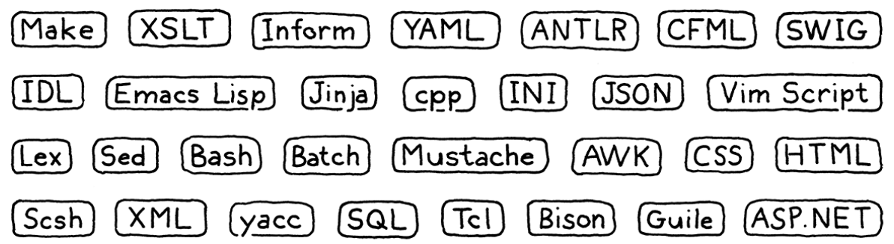

## Hoş geldiniz

Bu büyük bir maceranın başlangıcı olabilir. Programlama dilleri keşfetmek ve oynamak için devasa bir alandır. Başkaları ile paylaşmak ya da yalnızca kendini eğlendirmek üzere tüm yaratımlarınız için yer vardır. Nice parlak zekalı bilgisayar bilimcisi ve yazılım mühendisi bu alanı dolaşarak kariyerlerini geçirmiş ve sonuna varamamıştır. Eğer bu kitap ülkeye ilk girişinizse, hoş geldiniz.

Bu kitabın sayfalarında diller dünyasının bir kısmına doğru bir tur rehberliği bulacaksınız. Botlarımıza binip yola çıkmadan evvel, araziyi tanımalıyız. Bu kısımdaki bölümler programlama dillerince kullanılan temel kavramları ve bu kavramların nasıl organize edildiğini tanıtmaktadır.

Ayrıca kitabın geri kalanı boyunca uygulayacağımız Lox dili ile tanış olacağız.

# Giriş

> Masallar gerçekten fazlasıdır: bize ejderhaların var olduğunu anlattıkları için değil, ejderhaların yenilebilir olduğunu anlattıkları için.
> 
> G.K. Chesterton

Birlikte bu yolculuğa çıkmaktan heyecan duyuyorum. Bu kitap programlama dilleri için yorumlayıcılar yapmak üzerine. Ayrıca yorumlamaya değer bir dil tasarlamak üzerine de. Bu kitap ben programlama dillerine bulaşmadan önce keşke olsaydı dediğim, on yıla yakın süredir kafamda yazdığım bir kitap.

Bu sayfalarda, tam teşekküllü bir dil için iki bütün yorumlayıcıyı adım adım inceleyeceğiz. Bunun dillere ilk adımınız olduğunu varsayıyorum, bu nedenle tam, kullanışlı ve hızlı bir dil implementasyonu yapmak için kavramları ve her bir satır kodu ele alacağız.

İki tam implementasyonu bir kitaba sığdırmak için bu kitapta teoriyi hafif tuttuk. Sistemin parçalarını inşa ettikçe, arkalarındaki tarih ve kavramları da tanıtacağız. Jargona alışmanızı sağlayacağız ki bir gün kendinizi programlama dili araştırmacıları ile bir partide bulursanız ortama uyum sağlayabileceksiniz.

> Garip bir şekilde, kendimi bir çok kez bu durumun içinde buldum. Aralarından bazılarının ne kadar içtiğine inanamazsınız.

Ancak çoğu zaman enerjimizi dili çalışır tutmak için kullanacağız. Bu demek değildir ki teori ehemmiyetsizdir. Bir dil üzerinde çalışırken söz dizimi (syntax) ve anlam (semantics) üzerine muntazam düşünebilmek hayati bir yetkinliktir. Kişisel olarak ben, yaparken öğrenen biriyim. Benim için paragraflar dolusu soyut kavram arasında gezerek onları özümsemek zor bir şeydir. Ancak bir şeyi kodlayıp, çalıştırıp, hata ayıkladığımda, onu anlamış olurum.

> Bilhassa statik tip sistemleri titiz akıl yürütme ister. Bir tip sistemi üzerinde düşünmek matematikte bir teorem kanıtlamakla aynı hissi verir.
> Bu benzerlik tesadüf değildir. Geçtiğimiz yüzyılın ilk yarısında Haskell Curry ve William Alvin Howard bilgisayar programları ile matematiksel kanıtların aynı paranın iki yüzü olduklarını göstermiştir: [Curry-Howard izomorfizmi](https://en.wikipedia.org/wiki/Curry%E2%80%93Howard_correspondence)

Gerçek bir dilin nasıl yaşadığı ile ilgili somut bir sezgiye sahip olmanızı amaçlıyoruz. Böylece ileride daha teorik itaplar okuduğunuzda oradaki kavramlar bu altyapının üzerine daha akılda kalıcı olacaktır.

## 1.1 Bunları Neden Öğrenelim?

Derleyici kitaplarının giriş bölümlerinde bu başlık hep oluyor. Programlama dilleri konusunda bu kafa neden var bilmem. Ornitoloji kitaplarında eminim böyle bir şey yoktur. Okuyucunun kuşları sevdiği düşünülerek doğrudan konuya giriliyordur.

Programlama dilleri biraz daha farklı tabi. Sanırım birimizin geniş çapta başarılı, geniş amaçlı bir programlama dili yaratma ihtimalinin düşük olduğu doğrudur. Yaygın kullanılan dillerin tasarımcılarını toplasak bir minibüse sığarlar. Eğer dil öğrenmekte tek amaç o gruba girmek olsaydı, bu pek mantıksız olurdu. Neyse ki, öyle değil.

### 1.1.1 Küçük diller her yerde

Başarılı her genel amaçlı dile karşılık, başarılı binlerce niş dil bulunur. Eskiden bunlara "küçük diller" derdik; ancak terminoloji dünyasındaki kavram enflasyonu, yerlerini "alana özgü diller" (domain-specific languages) ifadesine bıraktı. Bunlar, belirli bir iş için özel olarak tasarlanmış, basitleştirilmiş ve amaca yönelik dillerdir (pidgin'lerdir). Uygulama betik dillerini, şablon motorlarını, işaretleme formatlarını ve yapılandırma dosyalarını buna örnek olarak düşünebilirsiniz.

> Karşınıza çıkabilecek küçük dillerden bazıları.

Neredeyse her büyük yazılım projesinde bu dillerden bir kısmı bulunur. Yapabildiğiniz durumda mevcut birini kullanmak kendi dilini icat etmekten daha akıllıca olur. Dokümantasyon, hata ayıklayıcılar, editör desteği, sözdizimi renklendirme ve diğer tuzaklara da düştüğünüzde, kendiniz yapmak zorlu bir iş olacaktır.

Yine de ihtiyaçlarınıza uyan bir kitaplık olmayan durumlarda kendinizi hızlıca bir ayrıştırıcı (parser) veya başka bir araç hazırlarken bulabileceksiniz. Başka birinin yaptığını kullanırken de ihtiyacınıza göre kurcalamak da kaçınılmaz olacaktır.

### 1.1.2 Diller iyi alıştırmadır

Maraton koşucuları bazen bilek ağırlıklarıyla veya atmosferin ince olduğu yükseklerde antrenman yaparlar. Bu yüklerden kurtulduklarında hem daha uzağa hem de daha hızlı koşabileceklerdir.

Bir dil implement etmek programlama yeteneğinin gerçek bir sınamasıdır. 