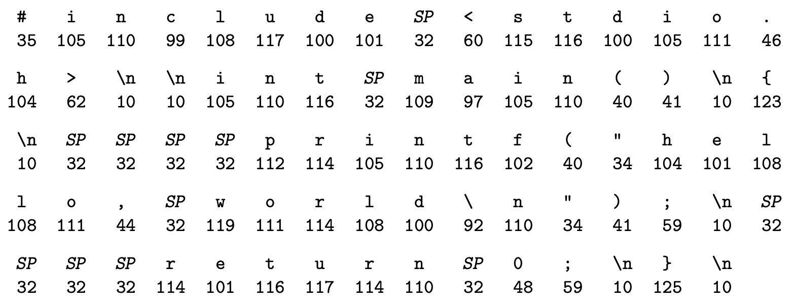

# Bilgisayar Sistemlerine Bir Bakış

Bir *bilgisayar sistemi* uygulama programlarını işletmek için birlikte çalışan donanım ve sistem yazılımından oluşur. Sistemlerin belirli uygulamaları (implementasyonları) zaman içinde değişir, ancak bunların altında yatan kavramlar değişmez. Bütün bilgisayar sistemleri benzer işlevleri yürüten benzer donanım ve yazılım bileşenlerine sahiptir. Bu kitap bu bileşenlerin nasıl çalıştıkları ve programların doğruluk ve performansını nasıl etkilediklerini anlayarak üretimlerinde daha iyi olmak isteyen programcılar için yazılmıştır.

Heyecan verici bir yolculuğun henüz başındasınız. Bu kitapta anlatılan kavramları doğru öğrenirseniz, altta yatan bilgisayar sistemini ve uygulama programlarınıza etkisini anlayarak aydınlamış, o nadir bulunan "güçlü programcı" olma yolunda ilerleyebilirsiniz.

Bilgisayarların sayıları temsil etme şeklinden kaynaklanan garip sayısal hatalardan nasıl kaçınabileceğiniz gibi pratik yöntemler öğreneceksiniz. Modern işlemci ve bellek sistemlerinin tasarımlarından istifade eden akıllı numaralarla C kodunuzu nasıl optimize edeceğinizi öğreneceksiniz. Derleyicinin nasıl prosedür çağrısı yaptığını öğrenerek bu bilgiyle ağ ve İnternet yazılımının başına bela olan tampon taşması (buffer overflow) zaaflarından kaynaklı güvenlik açıklarını önleyebileceksiniz. Ortalama programcıyı şaşırtan linkleme hatalarını nasıl tanıyıp önleyebileceğinizi öğreneceksiniz. Kendi Unix kabuğunuzu, kendi dinamik depolama tahsis paketinizi hatta kendi Web sunucunuzu yazmayı öğreneceksiniz. Tek çipe çok sayıda işlemci çekirdeği entegre edildiğinden bu yana önemi giderek artan bir konu olan eşzamanlılığın (concurrency) sunduğu vaatleri ve tuzakları öğreneceksiniz.

Bir klasik olan K&R-C'de Kernighan ve Ritchie, şekil 1.1'de gösterilen *hello* programı ile C dilini okurlarına tanıtırlar. *hello* çok basit bir program olsa bile, sistemin her majör parçası onu sonuna kadar yürütebilmek için uyum içinde çalışmak zorundadır. Bu kitabın amacı da bir bakıma sisteminizde *hello*'yu çalıştırdığınızda neyin neden olduğunu anlamanızı sağlamaktır.

Çalışmamıza *hello* programının yaşam öyküsünü izleyerek başlıyoruz, programcı tarafından yazıldığı andan, bir sistemde çalıştırıldığı, basit mesajını yazdırdığı ve sonlandığı ana kadar. Programın yaşam öyküsünü izlerken temel kavramlara, terminolojiye ve devreye giren bileşenlere kısaca değineceğiz. Sonraki bölümler bu fikirler üzerine genişleyecektir.

```c
#include <stdio.h>

int main()
{
   printf("hello, world\n");
   return 0;
}
```

*Şekil 1.1* hello programı.


*Şekil 1.2* hello.c'nin ASCII metin temsili.

## 1.1 Bilgi Bitler + Bağlamdır

Programımız *hello* hayata programcının bir editörde yazıp *hello.c* isminde bir metin dosyası olarak kaydettiği bir **kaynak program** (veya **kaynak dosya**) olarak başlar. Bu kaynak program her biri 0 veya 1 değerinde, bayt (byte) denilen sekizli parçalar halinde düzenlenmiş bir bitler dizisidir. Her bayt programdaki bir metin karakterini temsil eder.

Çoğu bilgisayar sistemi metin karakterlerini her bir karakteri benzersiz bir bayt-boyutunda tamsayı değeri ile temsil eden ASCII standardını kullanır. Şekil 1.2'de *hello.c* programının ASCII temsili gösterilmektedir.

## 1.2 Programlar Başka Programlar Tarafından Farklı Biçimlere Çevrilir

## 1.3 Derleme Sistemlerinin Nasıl Çalıştığını Anlamak Faydalı Olur

## 1.4 İşlemciler Bellekte Saklanan Talimatları Okur ve Yorumlar

## 1.5 Önbellekler Önemlidir

## 1.6 Depolama Cihazları Bir Hiyerarşi Oluşturur

## 1.7 İşletim Sistemi Donanımı Yönetir

## 1.8 Sistemler Ağlar Aracılığıyla Diğer Sistemlerle İletişim Kurar

## 1.9 Önemli Konular

## 1.10 Özet
